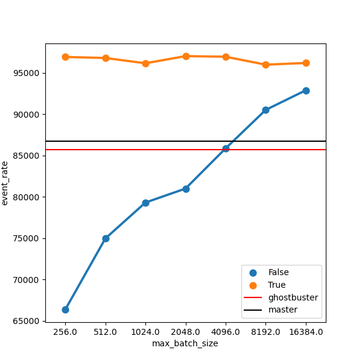

# Compare event rate in Allen

The above plot shows the event rate against the batch size for the
following scenarios:
- multiple instances of `ghostbuster` (1-5)
- `ghostbuster` is loaded, but inference is skipped
- load models of two different sizes (two side-by-side panels)
- baseline: run an "identical" sequence without `ghostbuster`

`master` @ 2022-11-10

## Comments on baseline event rate

`master` @ 2022-09-30

While the relative performance w.r.t. to the peak is changes
significantly, the absolute event rate changes by a smaller fraction
in comparison (~5%).  I checked the order of algorithms in the
sequence with `ghostbuster`, it changes significantly.  So
essentially, adding TRT kernels have unpredictable changes to the
order of algorithms, leading to a large variance in performance.
