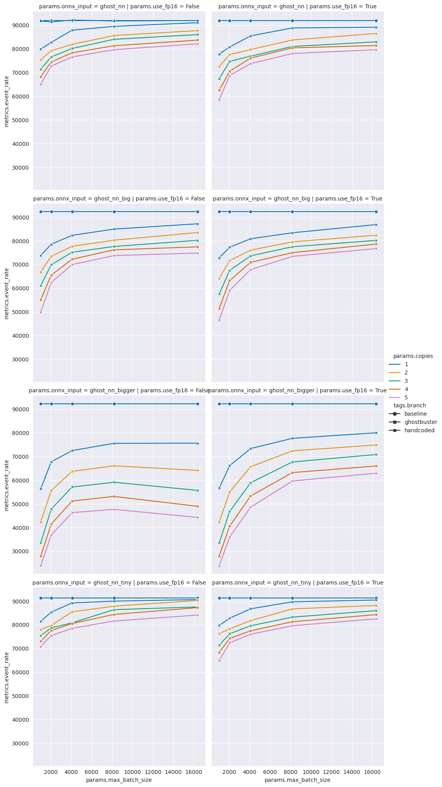

# Compare event rate in Allen

The above plot shows the event rate against the batch size for the
following scenarios:
- multiple instances of `ghostbuster` (1-5)
  - 5 and some points from 4 are missing, because the job ran out of time
- `no_infer` means `ghostbuster` is loaded, but inference is skipped
- load models of two different sizes (split in rows)
- force FP16 during inference (split in columns)
- baseline: run an "identical" sequence without `ghostbuster` (`master` @ 2022-12-01)
